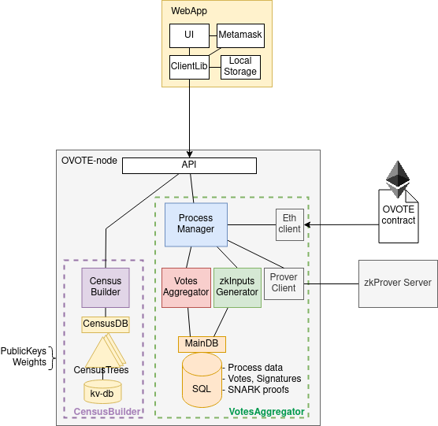

# ovote-node [](https://godoc.org/github.com/aragonzkresearch/ovote-node) [](https://goreportcard.com/report/github.com/aragonzkresearch/ovote-node) [](https://github.com/aragonzkresearch/ovote-node/actions?query=workflow%3ATest)

*Research project.*

OVOTE: Offchain Voting with Onchain Trustless Execution.

This repo contains the OVOTE node implementation, compatible with the [ovote](https://github.com/aragonzkresearch/ovote) circuits & contracts. All code is in early stages.

More details on the ovote-node behaviour can be found at the [OVOTE document](https://github.com/aragonzkresearch/research/blob/main/drafts/ovote.pdf).



## Usage
In the `cmd/ovote-node` build the binarh: `go build`

Which then can be used:
```
> ./ovote-node --help
Usage of ovote-node:
  -d, --dir string        storage data directory (default "~/.ovote-node")
  -l, --logLevel string   log level (info, debug, warn, error) (default "info")
  -p, --port string       network port for the HTTP API (default "8080")
  -c, --censusbuilder     CensusBuilder active
  -v, --votesaggregator   VotesAggregator active
      --eth string        web3 provider url
      --addr string       OVOTE contract address
      --block uint        Start scanning block (usually the block where the OVOTE contract was deployed)
```

So for example, running the node as a CensusBuilder and VotesAggregator for the ChainID=1 would be:
```
./ovote-node -c -v -l=debug \
--eth=wss://yourweb3url.com --addr=0xTheOVOTEContractAddress --block=6678912
```

### API

- POST `/census`, new census: creates a new CensusTree with the given keys & weights
  ```go
  // AddKeysReq is the data packet used to add keys&weights to a census
  type AddKeysReq struct {
          PublicKeys []babyjub.PublicKeyComp `json:"publicKeys"`
          Weights    []*big.Int              `json:"weights"`
  }
  ```
- GET `/census/:censusid`, get census: returns census info
- POST `/census/:censusid`, add keys to census:
  ```go
  // AddKeysReq is the data packet used to add keys&weights to a census
  type AddKeysReq struct {
          PublicKeys []babyjub.PublicKeyComp `json:"publicKeys"`
          Weights    []*big.Int              `json:"weights"`
  }
  ```
- POST `/census/:censusid/close`, close census: closes census
- GET `/census/:censusid/merkleproof/:pubkey`, get MerkleProof: returns the MerkleProof for the given PublicKey
- POST `/process/:processid`, send vote: stores the vote to be included in the rollup proof
  ```go
  // VotePackage represents the vote sent by the User
  type VotePackage struct {
          Signature   babyjub.SignatureComp `json:"signature"`
          CensusProof CensusProof           `json:"censusProof"`
          Vote        ByteArray             `json:"vote"`
  }
  ```
- GET `/process/:processid`, get process: returns process info
- POST `/proof/:processid`, generate proof: triggers proof generation
- GET `/proof/:processid`, get proof: returns the generated proof

### Test
- Tests: `go test ./...` (need [go](https://go.dev/) installed)
- Linters: `golangci-lint run --timeout=5m -c .golangci.yml` (need [golangci-lint](https://golangci-lint.run/) installed)
